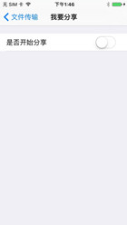
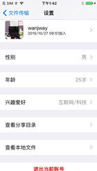
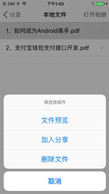
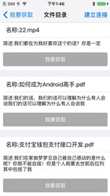
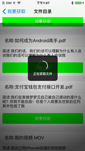
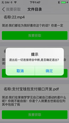

# 跨平台文件传输   
该系统主要是为了在不耗费用户流量的前提下解决跨平台文件传输问题

### 项目介绍   
本项目使用过程中主要分为两类对象：文件分享者和文件获取者，不同于茄子快传等已有跨平台传输应用，本研究的应用场景为：文件获取者打开APP，点击“我要获取”即可发现扫描周围已点击”我要分享”操作的文件分享者信息（包括头像、昵称、年龄、兴趣爱好等）；点击感兴趣用户即可查看和获取该用户分享的文件，双方不需要事先约定；   

*	文件分享者   
文件分享者首先需要向服务器注册账户，并向服务器提交需要分享的文件名及文件简介，服务器会在该注册用户下建立一个分享目录。 由于iOS系统的sandbox机制，除了相机图片和相机视频，iOS客户端可以分享的文件只能通过itune从外部添加。   
**注意：**倘若文件分享者在本地删除了已经向服务器提交的分享文件，则同时需要将该文件信息从服务器上删除。  

*	文件获取者   
文件获取者也需要先注册账号，   

### 跨平台文件传输过程   
主要分为三个过程：1、扫描并发现周围分享者，2、获取分享者的分享文件目录，3、文件传输   

1.	扫描并发现周围分享者    
该过程是基于BLE的（BLE扫描发现的速度快于WiFi扫描），主要是文件获取者扫描并发现周围所有文件分享者的基本信息（包括头像、性别、年龄、兴趣爱好等）。文件分享者打开BLE并广播，文件获取者打开BLE并扫描。由于在安卓系统上，只能发现周围广播的BLE而无法接收到BLE广播携带的数据，所以，文件分享者打开BLE广播的时候没有直接携带分享者信息。文件获取者获取文件分享者的信息是根据扫描到的文件分享者BLE的UUID，向服务器请求文件分享者的基本信息。为了保证UUID的唯一性，UUID是由用户在向服务器注册时由服务器自动分配的。用户每次在登录成功后，服务器即将该用户的UUID返回给用户，随后，用户即可利用该UUID进行BLE广播。   
**说明：由于BLE广播及扫描的范围有限，大概在50m左右，所以该过程只是在较小的范围内有效，但足以应对大多数的应用场景（比如餐厅，咖啡馆，教室等）**      

2.	获取分享者的分享文件目录   
文件获取者在获取到周围文件分享者的信息后，选择感兴趣的用户，即可向服务器获取该文件分享者所分享的文件目录（包含文件分享时间，文件名，文件简介），以列表形式展现在手机客户端。   
**说明：**如果文件分享者希望删除某个已分享的文件，有两种情况，1、删除服务器上该文件的信息，而在本地不删除。2、直接删除本地文件。如果是第二种情况，则用户在删除本地文件时，服务器上的该文件分享信息也被一同删除。   

3.	文件传输   
该过程又分为三种情况，1、安卓与安卓之间互传文件。2、iOS和iOS之间互传文件。3、iOS与安卓之间跨平台传输文件； 至于如何判断安卓与iOS系统，这是通过BLE的UUID，也就是第一个过程的扫描并发现周围分享者。比如说：文件获取者扫描周围BLE，根据扫描到的BLE的UUID，可以判别对方是安卓还是iOS系统，继而决定是采用哪种文件传输过程。   
**1、安卓与安卓之间互传文件**  
　文件获取者，点击需要获取的文件，则服务器采用推送通知的方式通知文件分享者建立wifi热点，并建立socket服务器（wifi热点名称的构成也是有一定规律的，可通过文件分享者的信息知道）。文件获取者自动接入该wifi热点，随后便通过socket通信传输文件。   
**2、iOS与iOS之间互传文件**   
　iOS与iOS之间传输文件不需要推送通知，而是可以直接采用multipeer connectivity框架进行文件传输。   
**3、iOS与安卓之间款平台传输文件**   
　该过程又分为两种情况1、iOS客户端作为文件分享者，安卓端作为文件获取者，2、iOS端作为文件获取者，安卓端作为文件分享者；由于iOS无法自动建立WiFi热点，在款平台传输时，所以无论iOS是作为文件获取者还是文件分享者，都是由安卓端建立WiFi热点和socket服务器。  
　1、iOS端作为文件分享者，安卓端作为文件获取者   
　用户获取者（安卓）点击获取文件后，同时建立wifi热点和socket服务器，并通过服务器，通知用户分享者（iOS）加入WiFi热点，并连接socket服务器。成功后利用socket通信进行文件传输。   
　2、iOS端作为文件获取者，安卓端作为文件分享者   
　文件获取者（iOS）点击“建立链接”，通过服务器，通知文件分享者（安卓）建立WiFi热点和socket服务器，文件获取者（iOS）手动接入热点，并链接socket服务器，继而进行socket通信，传输文件。   
　

### 部分截图   

> 
> 
>    
> 
> 
>    
> 
> 
>    
> 
>    

### 存在问题
1.	socket传输过程中速度不稳定问题、闭包丢包等问题尚未解决；   
2.	文件传输过程中的断点续传尚未解决；  
3.	多文件同时传输尚未解决；   
4.	由于iOS与iOS，安卓与安卓，iOS安卓之间文件传输采用的方法都不同，所以还存在一个兼容的问题。   

　

